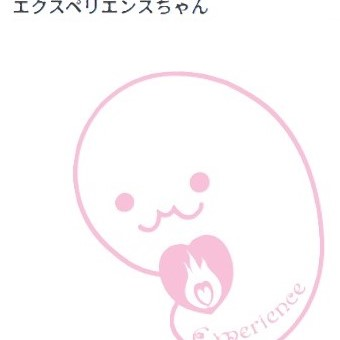

# SWIM EXPERIENCE スイム・エクスペリエンス
<html lang="ja" data-loaded="false" data-scrolled="false" data-spmenu="closed">
<head>

<meta charset="UTF-8">
<meta http-equiv="Content-Type" content="text/html; charset=UTF-8">
<meta http-equiv="X-UA-Compatible" content="IE=EmulateIE10" />
<meta http-equiv="X-UA-Compatible" content="IE=edge">

<meta name="viewport" content="width=device-width, initial-scale=1.0">
<title>スイム・エクスペリエンス ホームページ</title>
<meta name="author"content="スイム・エクスペリエンス">
<meta name="Keywords"content="スイム・エクスペリエンスとは,主な活動,エクスペリエンスちゃんとは？,スイムエクスペリエンスちゃんとは？,活動拠点、問い合わせ先">
<link href="style.css"rel="stylesheet">

<!--ここから上はお決まりの定型文です-->

<!--ここからが表現の書式などを決めるcssという部分-->

<link href="https://cdnjs.cloudflare.com/ajax/libs/lightbox2/2.7.1/css/lightbox.css" rel="stylesheet">

</head>

<body>

モバイル端末をお使いの場合は、画面を横向きにすると
より見やすくご覧頂けます。

<!--ここ上は、ほぼそのまま使います！-->

<!--QRコードの挿入例-->
<!--

 アクセス用QRコード

-->

<!--流れ文字の挿入例-->
<h1><marquee behavior="left">
スイム・エクスペリエンスとは、直訳すると、【競泳を体験・実感する】の意味です。<strong>SWIM EXPERIENCE</strong>の活動を体験してもらい、選手の理想通りに、上手く、速くなる実感を持つサポートをさせていただきます
</marquee></h1>

<!--ここから下が、本体部分-->

    
<h2>

<strong>主な活動</strong>
 </h2>

<h2>①<strong> 競泳選手傾向診断</strong></h2>
 

<h3> 競泳選手に必要な要素を数値化して、選手自身の得手不得手を</h3>
 

<h3> <mark>把握・見える化できて</mark>、今後の練習や、モチベーションに反映できます</h3>
 

<h2>②<strong> レース動画解析</strong>
 </h2>

<h3>　大会で撮影された動画を持ち込んでいただき</h3>
 

<h3>　スイム・エクスペリエンスが、<mark>客観的解析と選手の良い点</h3>
 

<h3>　今後のレースに生かす改善点</mark>をアドバイスします</h3>
 

<h3>③講習会<mark>（準備中）</mark></h3>
 

<h3>④練習会<mark>（準備中）</mark></h3>
 
 

    

         

   

   

         

  

      

<!--本体はここまで-->

<!--画面に空白地帯を作って、背景が見えるようにしています-->
                                              

<!-- フッタ -->
<footer>

Copyright 2025/07/14 Y. Omori

</footer>

<!--HPにさまざまなJavaScriptを呼び込むための書式-->

    
    </body>
    
</html>
